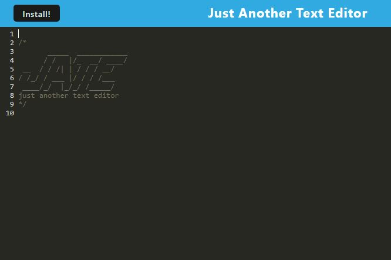

# text-editor

## Description

A PWA text editor that will let you write code to be saved on in indexedDB on close. src-sw was provided by class instructor and the rest of the source code can be found here: https://github.com/coding-boot-camp/cautious-meme

## Links

github repo: https://github.com/aalyman42/text-editor

heroku deploy: https://lyman-text-editor-f1e64079e35c.herokuapp.com/

## Screenshots

